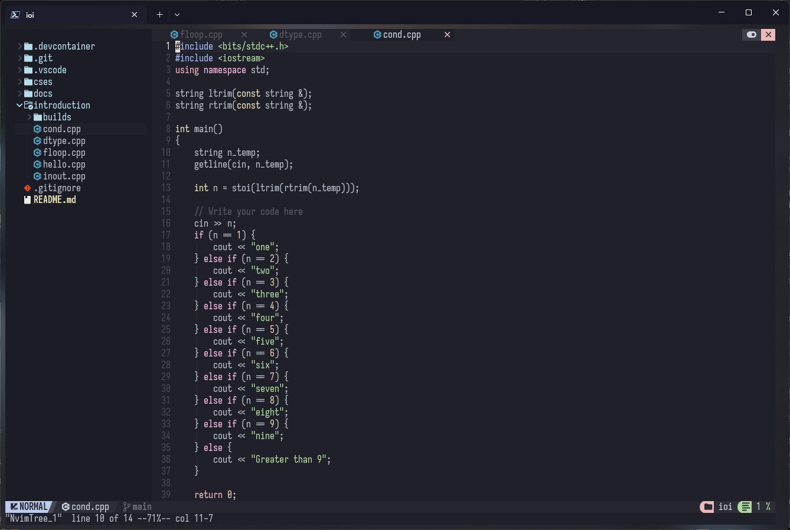

# lazydukk/dots

# Commands
using windows symlinks `mklink`

`mklink /J "{path to where the file should be linked}" "{path to original}"`
this creates dir junction

---
# Configs
- [GlazeWM & Zebar](./windows/.glzr) 

- [nvim](./windows/AppData/Local/nvim/)

    - using NvChad
    - configured for c++
    - [help](./windows/AppData/Local/nvim/help.md)

- [pwsh](./windows/Documents/PowerShell)    
    - [omp | oh-my=posh](./windows/omp-themes/)
